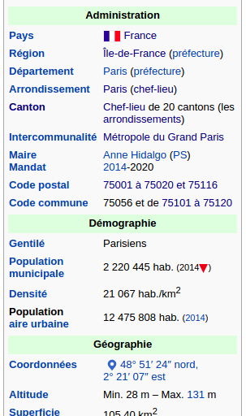
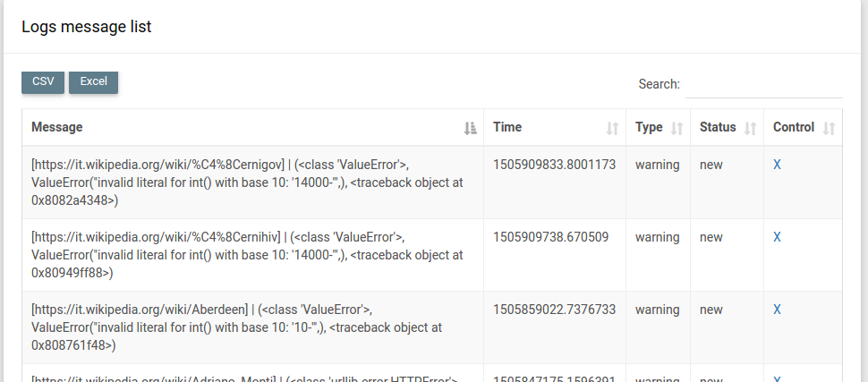
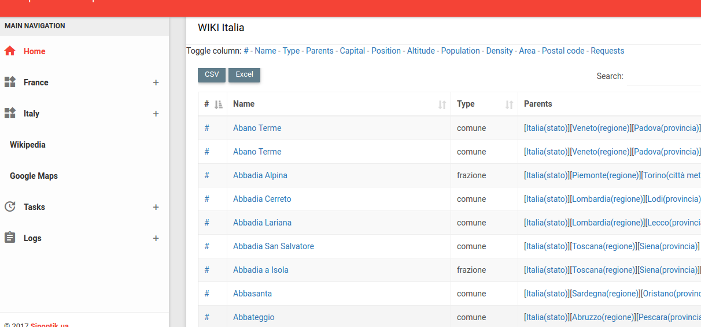
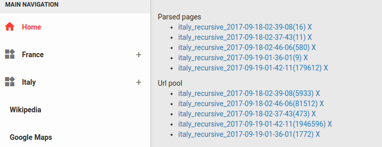

# Инструкция

Ниже будет изложено как адаптировать скрипты под анализ новых стран и сбор данных для них.
Для каждого источника есть свой раздел и пошагово описаны шаги для удобного подключения новой
страны в систему.

## Dev environment

В проекте используются инструменты
 - python 3.6
 - mongodb 3.4
 - Flask 0.12
 
Для удобной локально разработки внедрен конфигурационный файл для docker контейнеров.
В них внедрены все необходимые зависимости и прописаны все связи между подсистемами.
Для быстрого развертывания локально всех подсистем вам достаточно установить у себя
Docker(+ docker-compose) и выполнить команду из корня проекта:

```bash
.../WebCrawler_FR:$ docker-compose -f docker-compose-dev.yml up
```

Для отладки в IDE PyCharm есть конфиг для контейнера docker-compose-pycharm.yml с помощью
него вы получите все окружение в режиме отладки.

Для просмотра сырых данных в БД можно использовать MongoDB Compass оно требует запущенное 
docker окружение.

## Wikipedia

Википедия одна из сложных источников, так как оно содержит в себе данные которые добавлялись
разными авторами и в разное время.

### Parser

На каждой странце админ единици определенной страны есть блок с краткой информацией об этой
админ единице. Ее в первую очередь парсим. В основном там находится информация о названии,
населении, админ иерархии и т.д. Так-же по этому блоку можно понять что это страница админ
единици интересной нам страны, об этом ниже. Разберем код парсера по методам:

Парсеры находятся по адресу lib/parser/wiki . Есть общий класс "Wiki" который содержит в себе
методы которые актуальны для любой версии(очистка данных от шума, вытягивание числа из
строкового поля, а так-же формирование словаря с данными для удобного переноса его в локальное
хранилище). Каждый класс является интерпритацией страницы википедии, при его инициализации
в него помещается скаченная html страница для анализа.

Рассмотрим структуру класса на базе Французкой википедии и французкого языка

Файл с классом lib/parser/wiki/France.py

Для каждого класса нужно объявить ряд костант:

- HOST - в википедии все ссылки которые находятся в том-же домене сокращаются до относительного
пути и необходимо подставлять домен в начало ссылки для удобно загрузки данных после. Именно
эта константа выполняет эту роль.

- ADMIN_LEVEL_N - В константах этого типа приведена админ иерархия собираемой страны. Чем выше число
Тем ниже уровень админ единицы. Названия админ единиц вносятся на основном языке(на котором будем
парсить википедию). Эти константы используются для сбора админ иерархии анализируемого админ деления.

#### Описание методов:

- as_dictionary - этот основной метод в котором вызываются все анализаторы страницы и формируется
структурированный документ со свойствами админ единицы. Структуру полей можно посмотреть в докменте
data-structure.md в разделе Wiki. В родительском методе вызываются общие данные для страниц вики
на разных языках, но иногда есть и уникальные поля, к примеру у Франции это коды комунн.

- get_main_block - метод отвечает за поиск и отдачу данных из блока основных данных страницы, для
того, чтоб сократить расходы на анализ лишнего контента.



- get_name - получение названия админ единицы

- get_type - получение типа единицы, возвращаемое значение должно соответсвовать названию в константе
ADMIN_LEVEL_N

- get_admin_hierarchy - здесь формируется список родительских админ единиц в порядке убывания,
Первой идет страна и тд по убыванию. Текущая админ единица не входит в этот список.
Про структуру хранения этого списка можно посмотреть в документе data-structure.md

- get_altitude, get_population, get_density, get_area, get_capital, get_postal_codes - названия этих методов говорят сами
за себя, значения в этих полях должны быть приведены к общему формату который указан в докуметнте data-structure.md

- get_postal_codes - собирает почтовые коды этой админ единицы, для каждоый страны есть свой свод правил для
обработки произвольного формата в вики и трансформация его в список кодов.

- is_location_page - метода подтверждает, что загруженная страница является страницей админ единицы.

### Spiders

Для сбора данных из вики педии разработан набор скриптов который позволяет проверить код парсера или собрать
данные в автоматическом режиме.

#### Консольные команды

Для проверки работоспособности функционала парсера есть консольные команды которые принимают ряд пораметров
для изменения поведения. Находятся файлы по адресу console/commands/Название страны/ для каждой страны должны
быть свои файлы для запуска, которые соответствуеют особенностям сбора и обработки данных для этой страны.

К примеру файл console/commands/france/wiki_request.py принимает на вход параметр -q в котором находится запрос
в поисковую систему википедии в url декодированном формате и ищет в результатах страницы с админ единицами.
Пример:
 
```bash
python console/commands/france/wiki_request.py -q 'insee+74298'
```

Еще есть параметр -f который форсирует обновление документа даже если он уже существует в бд. Он нужен для
того, чтоб если в парсере была ошибка, то документ с исправленными данными обновтися без лишних телодвижений.

#### Сбор по данным из других источников

Для быстрого сбора данных в вики по поисковым запросам используются альтернативные источники информации, к примеру
список населенных пунктов страны и потом генерируются запросы на поиск по этим полям. Об этом механизме будет
расказано в разделе Tasks.

### Tests

В папке tests/wiki/Название страны/ есть перечень тестов которые проверяют функционал сборщиков для различных
страниц, для каждой новой страны должны быть копированы и портированы тесты для легкой проверки функционала

## Gmaps

Сборщик данных из гугл карт подходит под все страны, так как формат запроса и формат ответа у него одинаковый,
только меняется язык запрашиваемых данных и язык запроса. Сбор по координатам вообще ограничивается добавлением
позиции и языка ответа.

### Parser

Файлы анализатора находятся в папке lib/parser/map/google. Для каждой страны создается класс с необходимым
набором погружения в админ деления и все (пример класса для Франции lib/parser/map/google/France.py), 
остальной функционал сборщика реализован в родительском классе GMap.py такие как разделение множественного 
ответа на разные сущности, формирование документа для сохранения в бд и прочие обработчики для получения данных

## Loader

Загрузка данных из публичных источников осуществляется при помощи сопутствующих библиотек.
Для загрузки данных со страниц википедии используется urllib, для работы с GMaps используется
библиотека googlemaps. Так-же для повторного сканирования контента без обращения к поставщику 
используется обертка с кешированием ответа в mongodb с последующим достванием данных из нее при
повторном парсинге данных.

Классы загрузчиков находятся в папке lib/loader

## Tasks

Система последовательного сбора данных с запоминанием процесса и продолжение с места становки даже если система
была прервана неожиданно.

Для последовательного сбора было разработано несколько модулей:

- Выполнение последовательно списка задач с запоминанием процесса
- Выполнение узкоспециализированной задачи для каждого источника данных
- Логирование процесса для пост обработки ошибок в коде и парсинге
- Генератор задач на базе данных из сторонних источников (пример: Список населенных пунктов страны)

### Job list

Список задач формируется для каждого источник отдельно в зависимости от названия операции, чтоб не конфликтовать
с другими списками. У задачи есть три статуса:

- active - задача ожидает своей очереди
- in progress - сейчас выполняется
- done - выполнена

На выполнение из одного списка берется одна активная задача и выполняется, остальные ждут завершения текущей.
После окончания задачи ей присваивается статус выполнена и берется следующая активная задача.

Если задача завершилась с ошибкой, то проблемный запрос и причины ошибки записываюстя в лог ошибок, задача
помечается как выполненая и берется следующая задача на выполнение, так до конца списка итерации повтряются.

### Task type

Для у каждой задачи есть свой алгоритм выполнения, к примеру у сбора данных из википедии есть три разных алгоритма

- Рекурсивный сбор - вы создаете несколько задач в списке, к примере "деревни италии", "районы италии", "города италии"
и скрипт последовательно проходится по этим страницам и погружается во внутрь по ссылка, в поисках новых страниц
с данными населенных пунктвов. Его можно конфигурировать при помощи указания глубины погружеия. Данные о пройденом 
пути хранятся в БД и по этому скрипт дважды на одну и туже страницу не зайтет и не зациклится в круговом сборе.
Файл задачи для рекурсивного сбора lib/job/wiki/PageRecursiveTask.py 
Если сборщик прервать, то данные о пройденных страницах не будут утеряны, и можно возобновить обход с места 
остановки при помощи специальной команды в воркере(о нем будет написано ниже).

- Сбор по ссылкам, в задачи записываются ссылки на страницы в википедии и скрипт последовательно их обрабатывает.
Файл задачи lib/job/wiki/PageTask.py
 
- Сбор по поисковому запросу, срипт дейстует по сценарию, заходит на википедию, задает поисковый запрос и анализирует
выдачу, если находит страницы с админ единицами, то парсит их и сохраняет в бд.
Файл задачи lib/job/wiki/RequestTask.py

У каждого типа задачи есть свой обработчик worker и task_generator для наполнения систмы задачами.

#### Task generator

Для наполнения системы задачами используются скрипты для генеации и добавления их в журнал.
Для каждой страны должны быть написаны и портированы генераторы задач. Примеры генераторов можно посмотреть
тут console/task_generator/france. Опишу поднобно каждый для понимания работы:

- gmap_address.py - генерирует запросы к google maps исходя из собранных данных из википедии, с генерацией
уникального адреса для каждой админ единицы.
- gmap_position.py - генерирует запросы на базе гео координат для выборки данных из гугл карт. Данные берутся
из собранных пунктов википедии.
- wiki_request.py - генерирует задачи из файла со списком комунн Франции и отравляет их в очередь сбора данных.

Смысл этого функционала в том, чтоб подогнать внешние данные под формат сборщиков и наполнить план действия
паука по сбору данных при помощи парсеров.

#### Worker

Эти скрипты конфигурируют сборщик и запускают на выполнение задачи из списка запланированных.
Воркеры конфигурируются под каждую страну отдельно и хранятся в папке console/workers/Название страны/
Пример конфигурирования воркера можно взять с файла  console/workers/italy/wiki_task_recursive.py в основном
там будет меняться парсер тип задания. Если вы используете рекурсивный сборщик, то при каждой инициализации
он создает новую очередь из пройденных страниц, если вы хотите продолжит с прошлой очереди, то достаточно 
пробросить название очереди через параметр -t и тогда парсер продолжит работать с места остановки.
Пример:

```bash
python console/workers/italy/wiki_task_recursive.py -t italy_recursive_2017-09-19-01-42-11
```

## Error logger

Для каждого сборщика и задания есть свой логгер ошибок, и он сохраняет результаты в бд, для того, чтоб
разработчик мог их обработать и запустить повторный сбор данных по этоим запросам. Лог так-же поддерживает
авто закрытие одинаковых ошибок и если вы исправите ошибку и запустите сборщик на базе ошибок из лога, то
после подтверждения об успешном сборе ошибки удалятся из журнала, такое поведение поможет идентифициорвать
отличниые ошибки и фильтровать результаты в журнале относительно не исправленнных ошибок в сборщиках.

Список ошибок с запросом и причиной:




## Client

Клиент приложения написан на микро фреймворке flask, для клиентских скриптов выбрана адимин панель AdminBSB.
В отображении данных используется фильтрация по странам и таблица DataTable с фильтрацией и сортировкой полей.
Данные выгружаются сразу все на сторону клиента, есть выгрузка в формате csv. Так же выведены в админ панель задачи
и логи ошибок, а так-же информация о рекурсивном сборе данных. Клиентские данные находятся в папке client.

Клиентская страница



Статус по рекурсивному сбору

