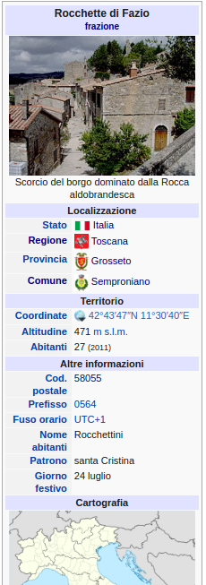
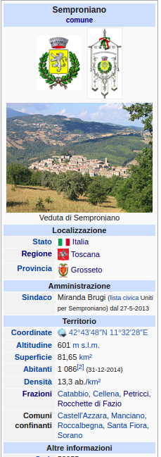
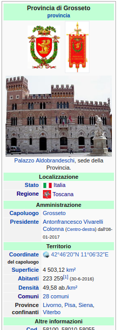
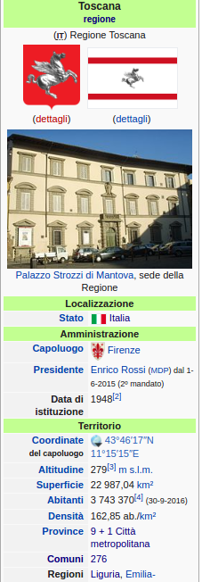
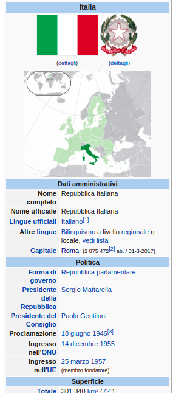

# Краткая информация

Сбор и парсинг информации со странц википедии.

Нужно собрать все админ деления, населенные пункты и полную информацию о них со страниц википедии.

В каждой стране и определенной языковой версии википедии в админ делениях 
есть свой блок с основной информацией. Для примера будет представленна страна
Италия на итальянском языке 
    

Ссылки на эти страницы:

- https://it.wikipedia.org/wiki/Italia
- https://it.wikipedia.org/wiki/Toscana
- https://it.wikipedia.org/wiki/Provincia_di_Grosseto
- https://it.wikipedia.org/wiki/Semproniano
- https://it.wikipedia.org/wiki/Rocchette_di_Fazio

Данные из этих таблиц должны быть сораны и приведены к единому формату.

Демонстрационный результат со страницы https://it.wikipedia.org/wiki/Provincia_di_Biella

```json
{
  'name': 'Provincia di Biella',
  'type': 'provincia',
  'admin_hierarchy': [
    {
      'url': 'https://it.wikipedia.org/wiki/Italia',
      'name': 'Italia',
      'type': 'stato'
    },
    {
      'url': 'https://it.wikipedia.org/wiki/Piemonte',
      'name': 'Piemonte',
      'type': 'regione'
    }
  ],
  'capital': {
    'url': 'https://it.wikipedia.org/wiki/Biella',
    'name': 'Biella'
  },
  'center': {
    'lat': '46',
    'lng': '8'
  },
  'population': 178870,
  'density': 195.85,
  'area': 913.28,
  'postal_codes': ['13900', '13811', '13812', '13813', '13814', '13815', ..., '13898', '13899']
}
```

Подробная информация о структуре будет выслана исполнителю.


# Подробное задание исполнителю

## Парсер населенных пунктов в википедии

В каждой стране и определенной языковой версии википедии в админ делениях 
есть свой блок с основной информацией. Для примера будет представленна страна
Италия на итальянском языке 
    

Ссылки на эти страницы:

- https://it.wikipedia.org/wiki/Italia
- https://it.wikipedia.org/wiki/Toscana
- https://it.wikipedia.org/wiki/Provincia_di_Grosseto
- https://it.wikipedia.org/wiki/Semproniano
- https://it.wikipedia.org/wiki/Rocchette_di_Fazio

Данные из этих таблиц должны быть сораны и приведены к единому формату. Перечень формтов 
находится в документе data-structure.md. Оформление кода должно соответствовать уже реализованному функционалу,
но сборщик должен будет расширен в зависимости от количество свойств в таблице на страницах википедии.
Описание функционала сборщика можно найти в документе connect-new-country.md в разделе Parser.

## Сборщик страниц

Нужно собрать все админ единицы выбранной страны, сопутствущий функционал уже разработан, как он
функционирует, можно посмотреть в файле connect-new-country.md

## Результат 
Файл с таблицей по всем данным из википедии для выбранной страны содержащий структурированные данные, не текстовые
значения должны быть в одном формате(если это площадь, то в квадратных километрах и тд).